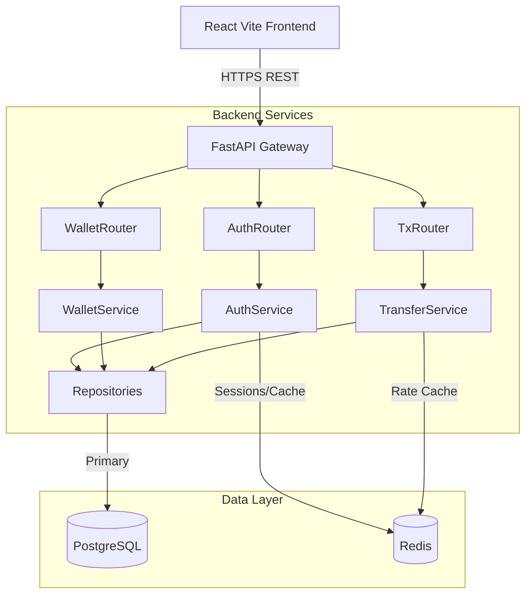

# 🏗️ System Architecture — PayPulse Wallet Platform

The platform is designed around a micro-monolithic architectural pattern. It features a clean separation of concerns, ensuring high maintainability and straightforward horizontal scaling as the platform grows.

---

## 🧩 Core Domain Model

| Domain Entity | Description | Key Attributes |
|---------------|-------------|----------------|
| **User** | The core identity of a platform member. | `id`, `email`, `password_hash`, `default_currency` |
| **Wallet** | Holds currency balances. A user can have one wallet per currency. | `id`, `user_id`, `currency`, `balance` (Numeric 18,6) |
| **Transaction** | Immutable ledger entry recording a financial event. | `id`, `wallet_id`, `type` (CREDIT/DEBIT), `amount`, `balance_after` |
| **Transfer** | Relational link tracking money movement between two users. | `id`, `sender_wallet_id`, `recipient_wallet_id`, `amount`, `exchange_rate` |

---

## 🛡️ Key Design & Security Decisions

1. **Precision Mathematics:** All financial balances utilize PostgreSQL `Numeric(18,6)` and Python's `Decimal` types. This strictly eliminates floating-point rounding errors native to standard float types.
2. **Stateless JWT Auth:** The application uses stateless JWTs (HS256) for access (15m expiry) and refresh (7d expiry) tokens, alongside `Argon2` for secure password hashing.
3. **Atomic Operations:** Credit, debit, and transfer actions execute within strict single database transactions (`db.commit()`), ensuring that the balance update and ledger entry insertion are committed together or rolled back safely.
4. **Observability First:** The backend is instrumented with `prometheus-fastapi-instrumentator`. Custom middleware tracks `http_errors_total` to allow immediate detection of 4xx/5xx error spikes via Grafana.

---

# 🚀 Scale Exercise — Design Note

> **Scenario Assumptions:** 500,000 registered users, 20,000 Daily Active Users (DAU), ~100 Transactions Per Second (TPS) peak throughput.

To smoothly support 100 TPS and 500k users, the architecture must evolve to distribute load and decouple non-critical processes.

## 1. Infrastructure Scaling Strategy

| Layer | Scaling Approach | Implementation Details |
|-------|------------------|------------------------|
| **Application Tier** | Horizontal Scaling | Deploy FastAPI containers across auto-scaling groups (e.g. AWS ECS / K8s HPA) triggered by CPU/Memory (>70%). Stateless JWTs ensure any pod can handle any request. |
| **Database (PostgreSQL)** | Read/Write Splitting | Single primary for writes; multiple read-replicas for balance queries and transaction history lookups. |
| **Connection Pooling** | PgBouncer | Deploy **PgBouncer** in transaction mode in front of PostgreSQL to handle thousands of concurrent client connections without DB overhead spikes. |
| **Database Partitioning**| Table Partitioning | Range-partition the `transactions` ledger table by `created_at` (e.g. monthly) to maintain query speed and index efficiency as the ledger grows indefinitely. |
| **Caching (Redis)** | Distributed Caching | Cache user balances and exchange rates in Redis Cluster. Invalidate explicitly on credit/debit events to eliminate redundant read load from Postgres. |

---

## 2. Asynchronous Processing & Resiliency

To prevent long-running tasks from tying up FastAPI workers:

- **Transactional Outbox Pattern:** Decouple non-critical paths (e.g., notification emails, audit logs, analytics ingestion). Write events to an `outbox` DB table within the same transaction, then process them asynchronously via Celery or RabbitMQ workers.
- **Idempotency Controls:** Require an `Idempotency-Key` HTTP header for all debit/transfer operations. Store these keys in Redis (TTL 24h) to strictly prevent duplicate balance deductions on client network retries.

---

## 3. Handling Exchange Provider Downtime

In the event that the external third-party FX provider goes offline:

- **Stale Cache Fallback:** We configure the Redis TTL for FX rates to outlast typical provider outages (e.g., 24-48 hours). The system is designed to seamlessly fall back to the most recently cached rates while flagging them as "stale" on the UI.
- **Circuit Breaker Pattern:** If the provider throws consecutive 5xx errors, a circuit breaker trips immediately, preventing cascading network timeouts and switching the app to fallback cache mode instantly.
- **Rate Spread Adjustment:** During prolonged downtime, the application can programmatically apply a safety margin (e.g., a +2% spread) to stale exchange rates to mitigate the business risk of currency volatility until the provider recovers.

---

## 4. Operational & Cost Optimisation

- **Traffic Routing:** Direct non-critical read traffic (`GET /transactions`, `GET /wallets`) strictly to read replicas.
- **Auto-Archiving (Cold Storage):** Move transaction records older than 1 year to cheap cold storage (e.g., AWS S3 + Parquet format queryable via AWS Athena) to optimize expensive DB disk costs.
- **Alerting Thresholds:** Configure PagerDuty / Slack alerts on `http_errors_total` rate > 2% or DB connection pool utilization > 80%.
